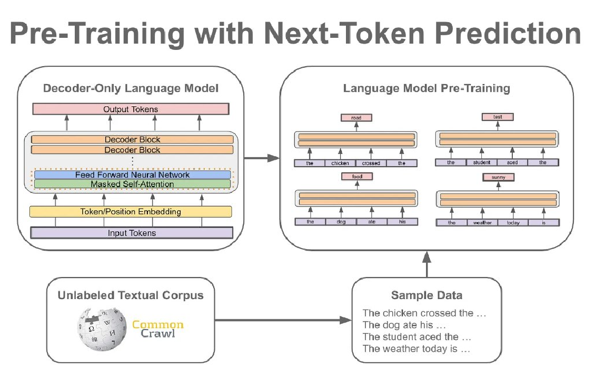
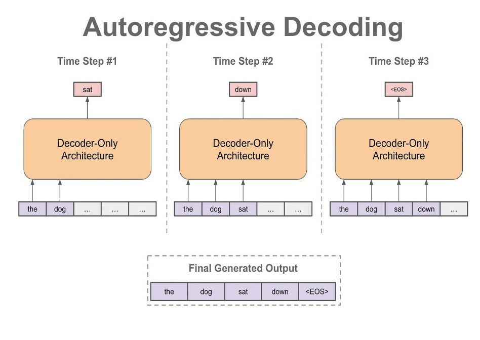

# LLM 训练数据制作手册（二）

## NLP 生成任务概述 

1. **NLP 是怎么做生成任务的？OpenAI 模型的 chat 和 completion 两种 API 有什么区别？**

回忆一下我们在第一次会议中讨论到的 huggingface 课程，NLP 的生成模型可以分为 `CasualLM` 还有 `Seq2SeqLM` 两种类型。

+ `CasualLM` 代表的模型架构是 GPT（decoder only 结构）
+ `Seq2SeqLM` 代表的模型架构是 T5（encoder-decoder 架构）

CasualLM 做续写任务有一定的优势。Seq2SeqLM 做 text-to-text 比较有优势。

这部分比较偏向理论，我们可以私下讨论。

2. **了解  `CasualLM`  经典的 Next-word-prediction 任务。**

Next-word-prediction 其实就是预测下一个词出现的概率，比如我再训练过程中，输入了 "今天天气真" 那么 模型就可以预测下一个单词 “好” 的概率。然后我们根据 “好” 这个单词所在的 token，计算对应的 CrossEntropy 来优化模型。

GPT 系列的模型，预训练时候就是通过 next token prediction，在海量的数据（通常是 1-100 TB 级别的）上训练的。可以参考下图：比如我们输入 `The chicken crossed the` 然后模型会预测下一个 token 是 `road`。 



**重点！重点！重点！**在实际训练当中，我们是对所有 target 统一进行预测的，比如 “今天天气真好，我们出去看电影吧”。如果我们在训练过程中输入 “今天天气真好，”， 那么模型应该对 “我们出去看电影吧” 这几个token 分别计算 CrossEntropy，而后进行反向传播优化。整个过程中我们只进行了一次前向传播。

而在推理过程中，我们是一个字一个字进行预测的，比如我们输入 "今天天气真好，"，模型会先推理出下一个字是 “我”；而后将 "今天天气真好，我" 传入到模型中，进行下一次预测。下图就是一个解码的例子：



> 以上为最基础的文本生成任务训练以及推理方案，在早些年，由很多针对文本生成的优化方案，比如说 teacher forcing 训练，beam search 优化等等。我们可以下一次再了解

3. **NLP 的训练数据是怎么样的？**

我们看到 [alpaca 数据集](https://huggingface.co/datasets/tatsu-lab/alpaca)，以 Alpaca 的数据为例子，可以看到 alpaca 数据大致分为 instruction，input 还有 output 三个属性。这三个属性会根据以下模板进行拼接，并传送到模型当中进行 next-word-prediction 优化。

```python
Below is an instruction that describes a task. Write a response that appropriately completes the request. 
### Instruction: {instruction} {input} 
### Response: {output}
```

比如我们有一个数据集:

```python
{'instruction':"Give three tips for staying healthy.",
'input':"",
'output':"1.Eat a balanced diet and make sure to include plenty of fruits and vegetables. 2. Exercise regularly to keep your body active and strong. 3. Get enough sleep and maintain a consistent sleep schedule."}
```

那么经过模板填充后，输入就变成了：

```text
"Below is an instruction that describes a task. Write a response that appropriately completes the request. 
### Instruction: Give three tips for staying healthy. 
### Response: 1.Eat a balanced diet and make sure to include plenty of fruits and vegetables. 2. Exercise regularly to keep your body active and strong. 3. Get enough sleep and maintain a consistent sleep schedule."
```

**重点！重点！重点！**为什么需要这样处理文本呢？直接让模型输入 `Give three tips for staying healthy. ` ，然后预测 `1.Eat a balanced diet and make sure to include plenty of fruits and vegetables. 2. Exercise regularly to keep your body active and strong. 3. Get enough sleep and maintain a consistent sleep schedule.` 不行吗？

+ Alpaca 是基于 LLaMa 训练的，因此 Alpaca 遵从 LLaMa 的模板进行额外的训练是很有必要的。

+ LLaMa 是 decoder 结构，decoder 结构的模型的原理是做续写任务。尝试以下，在不做任何 prompt 的情况下问模型 `how are you?`，模型大概率会续写你的内容，而非回答你：

```python
How are you? Hope this email fine you well...
```

如果你加上如下 prompt，那么模型就会回答你，而非进行续写任务：

```text
human: How are you?
assistant: I am doing well, thank you!
```

我们再以 [vicuna 的数据](https://huggingface.co/datasets/ehartford/wizard_vicuna_70k_unfiltered/viewer/ehartford--wizard_vicuna_70k_unfiltered/train?row=13)为例子，可以看到 vicuna 的数据是多轮对话的数据。

Vicuna 构建输入的模板是这样的：

```
human: {human_input_1}
assistant: {assistant_response_1}
human: {human_input_2}
assistant: {assistant_response_2}
```

本质上来说，也和 alpaca 一样，通过模板的方式，让一个续写模型实现了对话任务。

4. **对于目前的微调任务，我们需要如何准备训练数据集？**

image source: https://twitter.com/cwolferesearch/status/1669811217148289026


